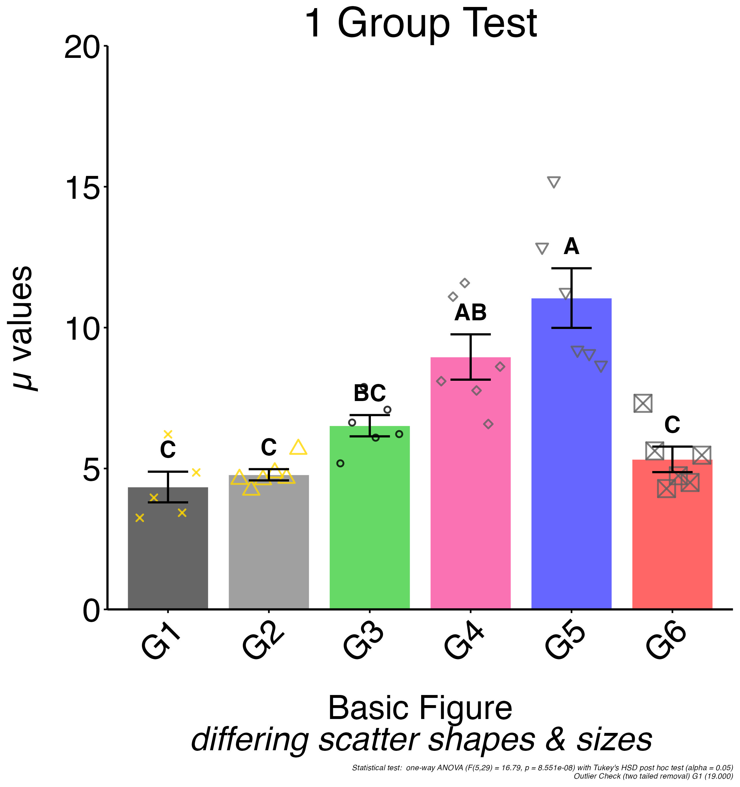
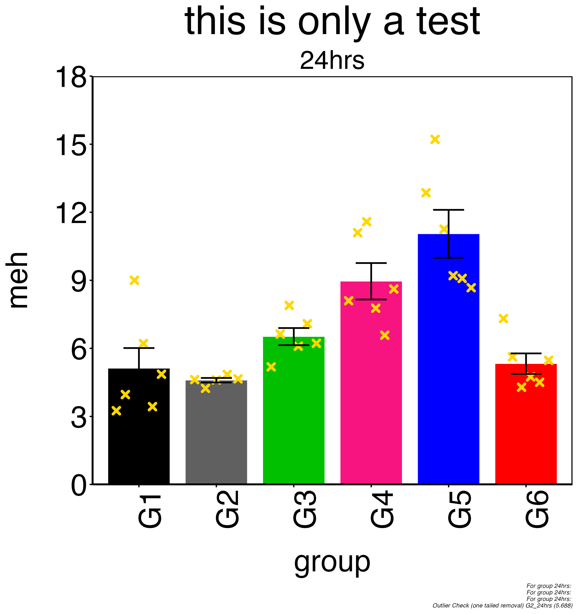

<!-- README.md is generated from README.Rmd. Please edit that file -->

```{r, include = FALSE}
knitr::opts_chunk$set(
  collapse = TRUE,
  comment = "#>",
  fig.path = "man/figures/README-",
  out.width = "100%"
)
```

**NOTE: This is still a work in progress *but* the package is functioning! I have begun to add new functions to make the package more interactive.** Immediate goals are to make the figure options (aesthetic & data) editable within R and then have the ability to write the figure data from session out to file. Functions now exist to view & edit figure options. Next step is to write the config file and then make the import of data from other sources possible. This will help integrate this package with things like [RQdeltaCT](https://github.com/Donadelnal/RQdeltaCT) (which enables generation of relative expression data from CT information) into a streamlined path to running QC and generating relative expression figures from RT-qPCR data. I have an R Markdown script that will be uploaded which walks through the use of both scripts...

**All Images in this readme are loaded from file since the plot output from generate_figure() or build_figure() have skewed dimensions from what is specified in the options and written to file.**

# histova

<!-- badges: start -->
<!-- badges: end -->

The goal of histova is to package a script that I am using to display a variety of data generated in a molecular biology lab (RT-qPCR, ELISA, protein quantification...) and enable the user to perform basic statistical tests on the data. Given that the desired layout and overall aesthetics of figures change depending on the audience (slide presentation vs. poster vs. paper etc.) *strange* custom features have been included to allow certain aesthetic settings to be defined in one **master** configuration file and essentially override all subsequent files allowing for batch application of formatting edits.

## Installation

You can install the development *aka* **UNCOMPLETE** version of histova from [GitHub](https://github.com/) with:

``` r
# install.packages("devtools")
devtools::install_github("smallwerke/histova")
```

This version needs to undergo final testing but appears to be fully functioning at this time.

## Overview

I will be adding more example configuration files in the near future along with more detailed examples. The basic premise is that the figures are generated based off of a simple text file that controls the appearance, statistical tests, and holds the raw data. This is often pasted in from excel or directly from an instrument. The file is tab delimited with the configuration options at the head. 

The header lines all begin with `#` with `##` denoting a comment and `#` a configuration setting. The default values and typical options are detailed in the config header. Example files are in [inst/extdata](https://github.com/smallwerke/histova/tree/main/inst/extdata).

Data lines are in the format of value->group1->group2.

I am currently planning on writing a function that will generate a config file for you that just needs to have data appended to it.

## Example

Basic use of the histova sript. Very simple process that generates a figure by specifying the source directory and the config file. The output figure is saved to the source directory.

All of the example config files are included in the extdata directory.

### Load Package

```{r exampleLoad}
library(histova)
library(stringr) # for the str_remove call needed in the readme file...
```

***The following examples are loading the final jpg figure that is produced. It is possible to have the package output a figure to RStudio for immediate examination though the font configuration is often incomplete.***

### One Group

A rather basic 1 Group version of this script that does include individual data points and the results of a ANOVA test displayed as letters in the figure with a p < 0.05 used for significance.

```{r example1}
f = "test-1_group-ANOVA_scatter_outlier.txt"
d = stringr::str_remove(histova_example(f), paste0("/",f))
# running generate_figure with plot display & save turned off since readme 
# saves in a temporary location
histova::generate_figure(d,f, FALSE, FALSE)

```

### Review Options

Print out the main aesthetic settings used for this plot (contained in the *figure* environment).

```{r option_print_out}
histova::opt_print("fig")
```

### Edit Option

Edit an aesthetic value.

```{r option_set}
histova::opt_set("fig", "X.Angle", 90)
histova::opt_set("the", "Location.File", "test-1_group-ANOVA_scatter_outlier-90.txt")
```

### Check Option

Print out the main aesthetic settings used for this plot (contained in the *figure* environment).

```{r option_print_out_check}
histova::opt_print("fig", "X.Angle")
histova::opt_print("the", "Location.File")
```

### Review Figure

See what changed.

```{r option_review_figure}
histova::build_figure(FALSE, FALSE)

```

## Config File

Following is a header file config file detailing all the various settings and outlining the defaults.

```{r configPrint}
# print out the full contents of the header sample file
# this is availabe in inst/extdata on gitub above
#
#
paste(readLines('inst/extdata/header_config.txt')) 
```

