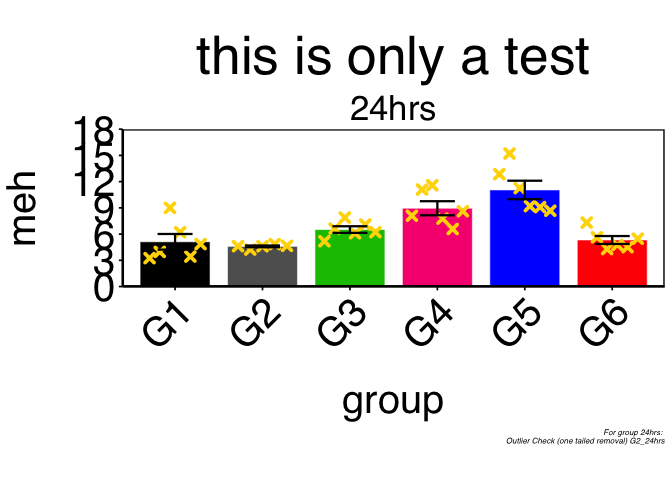

<!-- README.md is generated from README.Rmd. Please edit that file -->

**NOTE: This is very much a work in progress. The current script appears
functional but is in the process of going through extensive testing,
documentation, and code cleanup. However the initial very basic test
file worked. It is designed around the work I am doing routinely in a
molecular biology lab and it might be of use to others.**

# histova

<!-- badges: start -->
<!-- badges: end -->

The goal of histova is to package a script that I am using to display a
variety of data generated in a molecular biology lab (RT-qPCR, ELISA,
protein quantification…) and enable the user to perform basic
statistical tests on the data. Given that the desired layout and overall
aesthetics of figures change depending on the audience (slide
presentation vs. poster vs. paper etc.) *strange* custom features have
been included to allow certain aesthetic settings to be defined in one
**master** configuration file and essentially override all subsequent
files allowing for batch application of formatting edits.

## Installation

You can install the development *aka* **UNCOMPLETE** version of histova
from [GitHub](https://github.com/) with:

``` r
# install.packages("devtools")
devtools::install_github("smallwerke/histova")
```

I will be adding example configuration files in the near future along
with more detailed examples.

## Example

*this is just the boilerplate text that RStudio dumps out… I’ll edit
this once there are actual examples to be had…*

Basic use of the histova sript. Very simple process that generates a
figure by specifying the source directory and the config file. The
output figure is saved to the source directory.

### First Version

This is an old basic example of an early version of the script with
minimal options.

``` r
library(histova)
## basic example code
d = "/Users/Shared/HISTOVA_DATA"
f = "test.txt"
histova::generate_figure(d,f)
#> ----------------  ----------------  ----------------
#> -------- Prep & Load config settings and data --------
#> ---- Load config (file: test.txt)
#> ---- Load data (file: test.txt)
#>  6 final Group1_Group2 (statGroups - should be unique!) ids:
#>   G1_24hrs G2_24hrs G3_24hrs G4_24hrs G5_24hrs G6_24hrs
#> -------- Statistical Analysis --------
#> ---- Outlier checking
#> Warning in run_outlier(): ONE TAILED REMOVAL on group G2_24hrs (file: test.txt)
#> ---- Prep stats overview
#> -------- Build Histogram --------
#> Figure coordinate ratio for display: 0.1
#> ---- Generate Figure Labels
#> Warning in min(x): no non-missing arguments to min; returning Inf
#> Warning in max(x): no non-missing arguments to max; returning -Inf
#> saving your new figure to: '/Users/Shared/HISTOVA_DATA/test.jpg'
#> -------- SAVE Histogram --------
#> Warning: Using ragg device as default. Ignoring `type` and `antialias`
#> arguments
#> Warning in min(x): no non-missing arguments to min; returning Inf
#> Warning in max(x): no non-missing arguments to max; returning -Inf
#> ----------------  ----------------  ----------------
```


