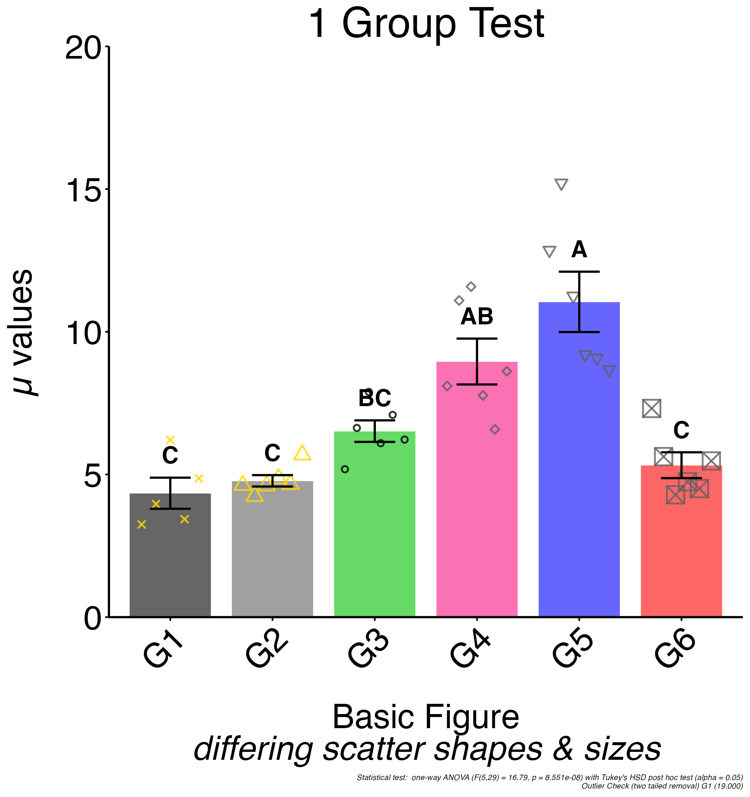

<!-- README.md is generated from README.Rmd. Please edit that file -->

**NOTE: This is still a work in progress *but* the package is
functioning and was able to recreate my previous set of test figures
without error. I am still going through and doing some code cleanup &
documentation before beginning to add more features. A few ggplot2
related warning messages still print during figure generation but the
code is functional. I will be uploading additional example configuration
files in the near future and adding documentation. The config header
file DOES explain all of the existing options.**

# histova

<!-- badges: start -->
<!-- badges: end -->

The goal of histova is to package a script that I am using to display a
variety of data generated in a molecular biology lab (RT-qPCR, ELISA,
protein quantification…) and enable the user to perform basic
statistical tests on the data. Given that the desired layout and overall
aesthetics of figures change depending on the audience (slide
presentation vs. poster vs. paper etc.) *strange* custom features have
been included to allow certain aesthetic settings to be defined in one
**master** configuration file and essentially override all subsequent
files allowing for batch application of formatting edits.

## Installation

You can install the development *aka* **UNCOMPLETE** version of histova
from [GitHub](https://github.com/) with:

``` r
# install.packages("devtools")
devtools::install_github("smallwerke/histova")
```

This version needs to undergo final testing but appears to be fully
functioning at this time.

## Overview

I will be adding more example configuration files in the near future
along with more detailed examples. The basic premise is that the figures
are generated based off of a simple text file that controls the
appearance, statistical tests, and holds the raw data. This is often
pasted in from excel or directly from an instrument. The file is tab
delimited with the configuration options at the head.

The header lines all begin with `#` with `##` denoting a comment and `#`
a configuration setting. The default values and typical options are
detailed in the config header. Example files are in
[inst/extdata](https://github.com/smallwerke/histova/tree/main/inst/extdata).

Data lines are in the format of value-\>group1-\>group2.

I am currently planning on writing a function that will generate a
config file for you that just needs to have data appended to it.

## Example

Basic use of the histova sript. Very simple process that generates a
figure by specifying the source directory and the config file. The
output figure is saved to the source directory.

All of the example config files are included in the extdata directory.

### Load Package

``` r
library(histova)
library(stringr) # for the str_remove call
```

***The following examples are loading the final jpg figure that is
produced. It is possible to have the package output a figure to RStudio
for immediate examination though the font configuration is often
incomplete.***

### One Group

A rather basic 1 Group version of this script that does include
individual data points and the results of a ANOVA test displayed as
letters in the figure with a p \< 0.05 used for significance.

``` r
f = "test-1_group-ANOVA_scatter_outlier.txt"
d = stringr::str_remove(histova_example(f), paste0("/",f))
# running generate_figure with plot display & save turned off since readme 
# saves in a temporary location
histova::generate_figure(d,f, FALSE, FALSE)
#> --------------------------------------------------------------------------------
#> ------------------------------- histova 3.5.0.1 --------------------------------
#> ----------------------- run on Mon May  6 18:33:06 2024 ------------------------
#> --------------------------------------------------------------------------------
#> -------- Prep & Load config settings and data --------
#>         file found and environments loaded successfully
#> ---- Initialize envrionment variables
#> ---- Load config (file: test-1_group-ANOVA_scatter_outlier.txt)
#> ---- Load data (file: test-1_group-ANOVA_scatter_outlier.txt)
#>         6 final Group1_Group2 (statGroups - should be unique!) ids:
#>              G1 G2 G3 G4 G5 G6
#> -------- Statistical Analysis --------
#> ---- Outlier checking
#>         TWO TAILED REMOVAL on group G1 (value 19, p.val: 2.34e-03)
#> Warning: FROM run_outlier(): TWO TAILED REMOVAL on group G1 (value 19, p.val:
#> 2.34e-03)
#> ---- Run stats prep (basic summaries)
#>         6 final Group1_Group2 (statGroups - should be unique!) ids:
#>              G1 G2 G3 G4 G5 G6
#> ---- ANOVA w/ Tukeys Post Hoc
#>         6 final Group1_Group2 (statGroups - should be unique!) ids:
#>              G1 G2 G3 G4 G5 G6
#> -------- Build Histogram --------
#> ---- Setting Aesthetics
#>         assigning settings for 6 groups (G1 G2 G3 G4 G5 G6)
#> ---- Building Histogram
#> ---- Generate Figure Labels
#> --------------------------------------------------------------------------------
#> --------------------- finihsed on Mon May  6 18:33:06 2024 ---------------------
#> --------------------------------------------------------------------------------

```


## Config

{r test, child=“inst/extdata/header_config.txt”, eval=TRUE}
